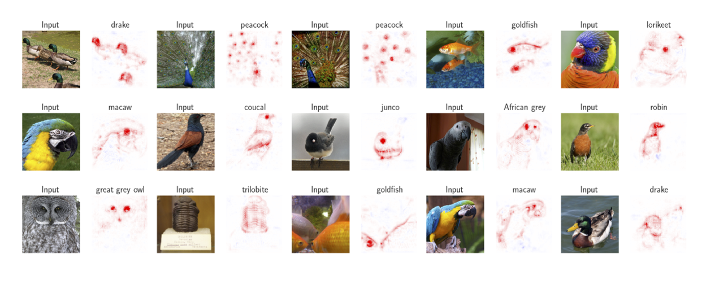

# Convolutional Dynamic Alignment Networks for Interpretable Classifications
Official implementation of the CVPR 2021 paper (oral): [Arxiv Paper](https://arxiv.org/pdf/2104.00032.pdf) | [GitHub Pages](https://moboehle.github.io/CoDA-Nets/) 

M. Böhle, M. Fritz, B. Schiele. **Convolutional Dynamic Alignment Networks for Interpretable Classifications**. CVPR, 2021.
<div style="displaystyle=block;align=center;"><p align="center" >
  
  </p>
</div>

# Overview

* [Examples](#examples-of-contribution-maps)
  - Apart from the examples shown above, we additionally present some [comparisons](#comparison-to-post-hoc-explanation-methods-evaluated-on-the-coda-nets) to post-hoc explanations evaluated on a CoDA-Net.
  - In order to highlight the stability of the explanations, we additionally present contribution maps evaluated on videos [here](#evaluated-on-videos).
  - For the latter, see [interpretability/eval_on_videos.py](interpretability/eval_on_video.py),
    for the others check out the jupyter notebook [CoDA-Networks Examples](CoDA-Networks%20Examples.ipynb).

* [Interpretability metrics](#interpretability-metrics)
  - [Here](#quantitative-interpretability-results) we present the quantitative results of the CoDA-Net interpretability for a model trained on CIFAR10.
  - In order to reproduce these plots, check out the jupyter notebook [CoDA-Networks Examples](CoDA-Networks%20Interpretability%20Eval.ipynb).
  - For more information, also check out the code in [interpretability/](interpretability/).
* Training
  - In order to retrain the models according to the specifications outlined in the paper, see the [experiments folder](experiments/)
* [License](#license)


## Comparison to post-hoc explanation methods evaluated on the CoDA-Nets
<div style="displaystyle=block;align=center;"><p align="center" >
  
  </p>
</div>


## Evaluated on videos
In order to highlight the stability of the contribution-based explanations of the CoDA-Nets, we present some examples for which the output for the respective class of the CoDA-Net was linearly decomposed frame by frame; for more information, see [interpretability/eval_on_videos.py](interpretability/eval_on_video.py).
<div style="displaystyle=block;align=center"><p align="center">
  
  
  
  
</p></div>

## Quantitative Interpretability results
In order to reproduce these plots, check out the jupyter notebook [CoDA-Networks Examples](CoDA-Networks%20Interpretability%20Eval.ipynb). For more information, see the paper and check out the code at [interpretability/](interpretability/)
|| <p align="center">Localisation metric</p> | <p align="center">Pixel removal metric</p> |
| ------ | ------ | ------ |
|  <p align="center">Compared to others</p>|   |  |
| <p align="center">Trained w/ different temperatures</p> |   |  |


# Copyright and license
Copyright (c) 2021 Moritz Böhle, Max-Planck-Gesellschaft

This code is licensed under the BSD License 2.0, see [license](LICENSE).

Further, you use any of the code in this repository for your research, please cite as:
```
  @article{Boehle2021CVPR,
          author    = {Moritz Böhle and Mario Fritz and Bernt Schiele},
          title     = {Convolutional Dynamic Alignment Networks for Interpretable Classifications},
          journal   = {2021 IEEE/CVF Conference on Computer Vision and Pattern Recognition ({CVPR})},
          year      = {2021}
      }
```

