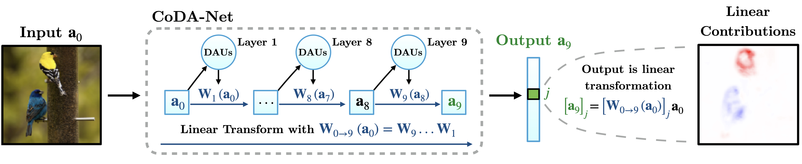
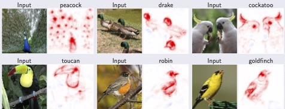
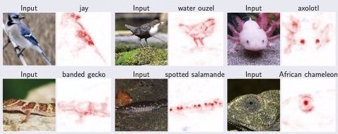
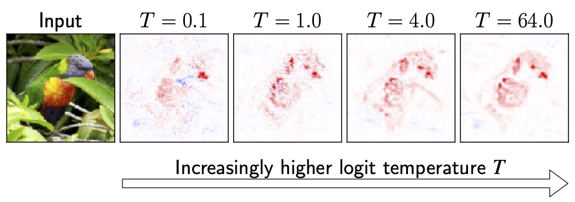

<div style="margin-left:auto; margin-right:auto; padding:0; text-align:center">
  
  
  
  
</div>
# Introduction
[CoDA Net Paper](https://arxiv.org/pdf/2104.00032.pdf)  |  [CoDA Nets on GitHub](https://github.com/moboehle/CoDA-Nets) 
|  [Method overview (CVPR Poster)](https://nextcloud.mpi-klsb.mpg.de/index.php/s/KkgQSe7RmT64Ntk)  |  [CoDA Nets on YouTube (CVPR Talk)](https://youtu.be/stdLYIzWWvw) 


Today's deep neural network architectures achieve impressive performances on a wide array of different tasks.
In order to pull off these feats, they are trained 'end-to-end' on large amounts of data, which allow them 
to learn the most useful features for a given task on their own
instead of relying on hand-crafted features designed by domain experts.
While the possibility for end-to-end training has significantly boosted performance, this approach comes at a cost: 
    as the feature extraction process is highly unconstrained, 
    it is difficult to follow the decision making process throughout the network and thus hard
    to understand in hindsight how a deep neural network arrived at a particular decision.

With our work on **Convolutional Dynamic Alignment Networks (CoDA Nets)**, we show that it is possible to train neural networks
end-to-end whilst constraining _how_ they are supposed to solve a task. By knowing the _how_, we can faithfully reflect
the decision making process and produce highly detailed explanations for the model predictions.
Despite these constraints, we show that CoDA Nets constitute performant classifiers. 
In particular, we show that it is possible to train CoDA Nets on image classification tasks and
'push' them to align their dynamically computed linear transformation weights
with discriminative patterns in the input. This allows us to decompose their predictions into linear contributions 
from individual input dimensions, which can be visualised as shown at the top of the page.


# High-level idea
## Model outline
<div style="displaystyle=block;align=center"><p align="center">
  
</p></div>
The CoDA Nets are built out of multiple CoDA layers, which in turn consist of many 
**Dynamic Alignment Units (see [below](#dynamic-alignment-units))**. Since every one of these layers 
transforms the input with an input dependent matrix and there exist no non-linearities _between_ any two dynamically
computed matrices, 
the entire CoDA network also performs a linear transformation of the input: the successive linear transformations
 are equivalent to a single linear transformation. Importantly, the output of the network
can now be decomposed _according to this linear transformation_, as shown in the figure above.

Further, we combine this _Dynamic Linearity_, i.e., input-dependent linear transformations,
with constraints on the dynamic weights in each layer. These constraints induce an 'alignment pressure' during optimisation,
since the network can only achieve large outputs for well-aligned matrices under these constraints. This ensures
that the linear decompositions of the network outputs actually align with features in the input and thus help 
us understand which regions the model was able to align its weights best with---in a classification task,
the model naturally learns to preferentially encode _discriminant features_.
 
## Dynamic Alignment Units
The CoDA Nets were designed 'bottom-up' to be interpretable neural network models and 
the Dynamic Alignment Units (DAUs) are the fundamental building blocks that we employ to achieve this.

In particular, the DAUs are based on two main principles, which were chosen such that they are inherited by networks built
out of DAUs. These principles are **Dynamic Linearity** and **weight constraints that induce alignment** 
when maximising the network outputs.

First, by making the DAUs **_dynamic linear_**, we explicitly obtain a dynamically computed weight vector
that is applied to the layer input. This allows us to use this vector to decompose the DAU outputs in terms of input 
contributions: the output is just a weighted sum of the entries in the input vector.
When using multiple DAUs in parallel in a Dynamic Alignment (DA) layer, the vector of DAU outputs is given as 
a linear transformation of the input with the rows in this matrix corresponding to the dynamic weights of the individual DAUs.
Given the lack of non-linearities between the matrices of successive DAU layers, outputs of DAU Nets can 
be decomposed via the same principle: the successive matrices are equivalent to a single linear transformation matrix
and the output thus a linear transformation of the input to the network. For example, in the following figure 
we present a selection of linear decompositions of the output logit into contributions from spatial locations for 
a CoDA Net trained on Imagenet data.
<div style="displaystyle=block; align=center; margin: auto">
  
</div>
<div style="displaystyle=block; align=center; margin: auto">
  
</div>

 However, while the dynamic linearity explicitly provides a way to decompose network activations,
these decompositions need not be meaningful explanations of the network behaviour: if the function computing the 
dynamic matrices is too complex and unconstrained, the network can achieve any output by any linear combination of the input values.

Therefore, as a second architectural constraint, we propose to additionally restrict the 
norm of the dynamically computed DAU weights, e.g., to unit norm. By doing this, the DAU outputs are bounded 
independently of the network parameters and can at most be as large as the norm of the input.
In order to achieve large outputs (relative to the input norm), the network therefore 
has to align the dynamic weights with the input, as visualised in the following figure.
 <div style="displaystyle=block; align=center; margin: auto">
  
</div>
Hence, when maximising the output of a single DAU over a set of inputs, the DAUs are
optimised to produce weights that are good angular reconstructions of those inputs, since they cannot increase the 
output by simply scaling up the weights.

Importantly, when optimising a network for classification, the network is trained to _maximise_ the logit of the
correct class. This in turn induces a maximisation in the DAUs of the network, which therefore 'learn' to 
align their weights with features that are useful for solving the classification task. 

As we discuss in our [paper](https://arxiv.org/pdf/2104.00032.pdf), 
we can emphasise this property of the CoDA Nets and artificially lower the network outputs by dividing them
 by a 'temperature' parameter T.
As a result, in order to achieve the same output magnitude for higher temperatures,
 the network needs to achieve better alignment throughout the network. 
<div style="displaystyle=block; align=center; margin: auto">
  
</div>
This is indeed what we observe, as exemplified in the above figure.

Feel free to contact us if you have questions or comments: [Author contact page](https://www.mpi-inf.mpg.de/departments/computer-vision-and-machine-learning/people/moritz-boehle)

# Copyright and license
Copyright (c) 2021 Moritz Böhle, Max-Planck-Gesellschaft

This code is licensed under the BSD License 2.0, see [license](LICENSE).

Further, if you use any of the code in this repository for your research, please cite as:
```
  @article{Boehle2021CVPR,
          author    = {Moritz Böhle and Mario Fritz and Bernt Schiele},
          title     = {Convolutional Dynamic Alignment Networks for Interpretable Classifications},
          journal   = {2021 IEEE/CVF Conference on Computer Vision and Pattern Recognition ({CVPR})},
          year      = {2021}
      }
```

